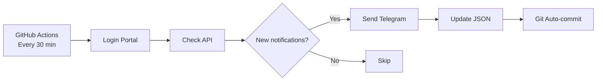

# TDTU Portal Notification Checker

Automated notification system for TDTU student portal - checks for new announcements every 30 minutes and sends to Telegram.

[](https://github.com/features/actions)
[](https://www.python.org/)
[](https://telegram.org/)

---

## Features

- **Automated Checking**: Runs every 30 minutes via GitHub Actions
- **Telegram Notifications**: Instant alerts to your phone
- **State Persistence**: Git auto-commit prevents duplicate notifications
- **Group Support**: Share with friends via Telegram groups
- **Serverless**: 100% free, runs on GitHub infrastructure
- **Secure**: Credentials stored in GitHub Secrets

---

## Quick Start

### Prerequisites

- GitHub account
- Telegram account
- TDTU portal credentials

### Setup (15 minutes)

1. **Create Telegram Bot** (5 mins)
   - Open Telegram → Search `@BotFather`
   - Send `/newbot` and follow instructions
   - Save your `BOT_TOKEN`

2. **Get Chat ID** (2 mins)
   - Start chat with your bot
   - Visit: `https://api.telegram.org/bot<YOUR_TOKEN>/getUpdates`
   - Copy `chat.id` from JSON response

3. **Fork & Configure** (5 mins)
   - Fork this repository
   - Go to **Settings** → **Secrets** → **Actions**
   - Add secrets:
     ```
     PORTAL_USERNAME
     PORTAL_PASSWORD
     TELEGRAM_BOT_TOKEN
     TELEGRAM_CHAT_ID
     HEADERS (User-Agent string)
     LOGIN_URL (Portal login endpoint)
     API_URL (Portal API endpoint)
     ```

4. **Enable Workflow** (2 mins)
   - Go to **Settings** → **Actions** → **General**
   - Enable "Read and write permissions"
   - Go to **Actions** tab → Enable workflows

5. **Test Run**
   - Actions tab → "TDTU Portal Checker" → Run workflow
   - Check Telegram for notification!

---

## Detailed Guides

- **[Telegram Bot Setup](TELEGRAM_SETUP.md)** - Create bot, get credentials & implementation guide
- **[Group Chat Setup](GROUP_SETUP.md)** - Add bot to group for team notifications
- **[GitHub Actions Setup](GITHUB_ACTIONS_SETUP.md)** - Deploy & configure automation

---

## Project Structure

```
portal_checker2/
├── news_checker.py              # Main script
├── seen_notifications.json      # State file (auto-managed)
├── .github/workflows/
│   └── checker.yml             # GitHub Actions workflow
├── .env.example                # Environment variables template
├── TELEGRAM_SETUP.md           # Telegram bot setup & implementation
├── GROUP_SETUP.md              # Group chat configuration
└── GITHUB_ACTIONS_SETUP.md     # Deployment guide
```

---

## How It Works



**State Persistence:**
- `seen_notifications.json` tracks processed notifications
- Workflow auto-commits changes after each run
- Next run loads updated state → no duplicates!

---

## Configuration

### Schedule (Edit `.github/workflows/checker.yml`)

```yaml
schedule:
  - cron: '*/30 * * * *'  # Every 30 minutes (default)
  - cron: '*/15 * * * *'  # Every 15 minutes
  - cron: '0 8,12,17 * * *'  # 8am, 12pm, 5pm only
```

Use [crontab.guru](https://crontab.guru) to generate schedules.

### Notification Format

Messages include:
- Title
- Summary (from API)
- Direct link to announcement

---

## Troubleshooting

### Workflow fails with "Permission denied"
- Settings → Actions → General → Enable "Read and write permissions"

### Bot doesn't send messages
- Check bot token in secrets
- Verify chat ID (negative for groups)
- Ensure bot is added to group (if using group chat)

### Duplicate notifications
- Check `seen_notifications.json` is being committed
- Verify workflow has write permissions

### More issues?
See detailed [Troubleshooting Guide](GITHUB_ACTIONS_SETUP.md#troubleshooting)

---

## Monitoring

**View Logs:**
- Actions tab → Click workflow run → Expand steps

**Disable Temporarily:**
- Actions tab → Workflow → "..." → Disable workflow

**Manual Trigger:**
- Actions tab → Run workflow button

---

## Contributing

Contributions welcome! Feel free to:
- Report bugs
- Suggest features
- Submit pull requests

---

## License

MIT License - See [LICENSE](LICENSE) file

---

## Acknowledgments

Built with:
- [Python Requests](https://requests.readthedocs.io/)
- [Telegram Bot API](https://core.telegram.org/bots/api)
- [GitHub Actions](https://github.com/features/actions)

---

## Contact

Issues? Questions? Open an issue or reach out via regret1505@gmail.com!

---

**Made with ❤️ for TDTU students**
